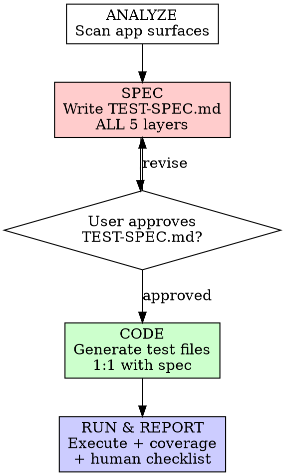

# Playwright Exhaustive Testing

## Overview

Automate every testable surface before any human testing. Spec first, code second.

**Core principle:** No test code without an approved TEST-SPEC.md. Automation must be exhaustive across ALL layers before outputting a human test checklist for what remains.

**Violating the letter of the rules is violating the spirit of the rules.**

## When to Use

- GSD `/gsd:verify-work` or `/gsd:add-tests` needs test coverage
- BMAD testing phase triggers
- User requests: "test app", "write tests", "e2e tests", "kiểm thử app"
- `playwright.config.*` detected in project
- Any workflow framework reaches its testing phase

**When NOT to use:**
- Unit testing only (use TDD skill instead)
- Non-web apps (CLI tools, libraries)
- Backend-only services without UI

## The Iron Law

```
NO TEST CODE WITHOUT AN APPROVED TEST-SPEC.md
```

Wrote test code before spec? Delete it. Start over.

**No exceptions:**
- Not for "just a quick smoke test"
- Not for "I already know what to test"
- Not for "deadline is tight, skip the spec"
- Not for "the app is simple enough"
- Delete means delete

## The 4-Phase Process



### Prerequisites

Before starting, ensure dependencies are installed:

```bash
npm install -D @playwright/test @axe-core/playwright
npx playwright install
```

### Phase 1: ANALYZE

**Actually read the codebase.** Do not guess or assume from file names alone.

1. **Read the codebase** - open and read actual route files, page components, API handlers
2. **Detect tech stack** - React/Vue/Next/Nuxt/Tauri/etc.
3. **Check existing coverage** - what tests already exist? (`e2e/`, `__tests__/`, `*.spec.*`)
4. **Map user journeys** - auth flows, CRUD operations, navigation
5. **Identify API contracts** - endpoints, request/response shapes
6. **Note interactive elements** - forms, modals, dropdowns, file uploads

Output: Mental model of app surface area. No files yet.

### Phase 2: SPEC → TEST-SPEC.md

Write `TEST-SPEC.md` covering ALL 5 mandatory layers:

| Layer | What | Priority | Tools |
|-------|------|----------|-------|
| **L1: Critical User Journeys** | E2E happy paths + error paths | P0 | Playwright actions |
| **L2: API Endpoints** | Request/response validation | P0 | `request` context or `page.route()` |
| **L3: Edge Cases** | Error states, empty states, loading, offline | P1 | Playwright + network interception |
| **L4: Accessibility** | axe-core audit on every page | P1 | `@axe-core/playwright` |
| **L5: Visual Regression** | Screenshot comparison per page/state | P2 | `expect(page).toHaveScreenshot()` |

**MANDATORY: All 5 layers must appear in TEST-SPEC.md.** No layer may be skipped or deferred.

Each test case in the spec:

```markdown
### TC-001: Login with valid credentials
- **Layer**: L1 - Critical User Journey
- **Priority**: P0
- **Automatable**: Yes
- **Steps**:
  1. Navigate to /login
  2. Fill email and password
  3. Click submit
  4. Verify redirect to /dashboard
- **Expected**: User lands on dashboard with correct username displayed
```

At the end of TEST-SPEC.md, include:

```markdown
## Coverage Target
- L1 Critical Journeys: X test cases
- L2 API Endpoints: X test cases
- L3 Edge Cases: X test cases
- L4 Accessibility: X pages audited
- L5 Visual Regression: X screenshots baselined
- Total automatable: X
- Total NOT automatable: X (listed below with reasons)

## Human Test Remainder
| # | What | Why not automatable |
|---|------|---------------------|
| H1 | UX flow feel/smoothness | Subjective perception |
| H2 | Design consistency review | Visual judgment |
| ... | ... | ... |
```

**GATE: Present TEST-SPEC.md to user. DO NOT proceed to Phase 3 until user approves.**

### Phase 3: CODE

Generate Playwright test files mapping 1:1 to approved spec:

```
e2e/
├── fixtures/
│   ├── auth.setup.ts          # Auth state setup
│   └── test-data.ts           # Shared test data
├── helpers/
│   └── page-objects/          # Page Object Model
├── journeys/                  # L1: Critical User Journeys
│   ├── auth.spec.ts
│   ├── dashboard.spec.ts
│   └── ...
├── api/                       # L2: API Endpoints
│   └── endpoints.spec.ts
├── edge-cases/                # L3: Edge Cases
│   ├── error-states.spec.ts
│   ├── empty-states.spec.ts
│   └── loading.spec.ts
├── accessibility/             # L4: Accessibility
│   └── a11y-audit.spec.ts
└── visual/                    # L5: Visual Regression
    └── screenshots.spec.ts
```

**Rules:**
- Every TC-XXX in spec → exactly one `test()` block in code
- Use Page Object Model for shared interactions
- Use `test.describe()` to group by feature, not by page
- Auth fixtures use `storageState` for efficiency
- API tests use `request` context, not browser navigation
- A11y tests use `@axe-core/playwright` with `checkA11y()`
- Visual tests use `toHaveScreenshot()` with reasonable thresholds

### Phase 4: RUN & REPORT

1. **Run all tests**: `npx playwright test`
2. **Generate report**: `npx playwright show-report`
3. **Create TEST-REPORT.md**:

```markdown
# Test Report

## Summary
- Total tests: X
- Passed: X | Failed: X | Skipped: X
- Coverage by layer:
  - L1 Journeys: X/X passed
  - L2 API: X/X passed
  - L3 Edge Cases: X/X passed
  - L4 Accessibility: X violations found on Y pages
  - L5 Visual: X/X screenshots matched

## Failed Tests
[Details of any failures with screenshots]

## HUMAN-TEST-CHECKLIST.md
[Generated from TEST-SPEC.md "Human Test Remainder" section]
Items that could NOT be automated - requires human judgment:
- [ ] H1: ...
- [ ] H2: ...
```

## Quick Reference

| Phase | Output | Gate |
|-------|--------|------|
| ANALYZE | Mental model | None |
| SPEC | TEST-SPEC.md | **User must approve** |
| CODE | Test files in e2e/ | None |
| RUN | TEST-REPORT.md + HUMAN-TEST-CHECKLIST.md | None |

## Common Rationalizations

| Excuse | Reality |
|--------|---------|
| "Deadline gấp, skip spec" | Spec takes 15 min. Writing wrong tests wastes hours. |
| "App đơn giản, không cần spec" | Simple apps have hidden complexity. Spec exposes it. |
| "Skip visual regression, tốn thời gian" | `toHaveScreenshot()` takes 1 line per page. No excuse. |
| "A11y test later" | A11y is mandatory, not optional. axe-core setup takes 5 min. |
| "Chỉ test happy path trước" | Happy path only = false confidence. Error paths catch real bugs. |
| "Tôi đã biết cần test gì" | Your mental model has gaps. Spec forces completeness. |
| "Quick smoke test trước, spec sau" | Smoke test without spec = random test. Delete and start over. |

## Red Flags - STOP and Restart from Phase 1

- Writing test code before TEST-SPEC.md exists
- TEST-SPEC.md missing any of the 5 layers
- Proceeding to code without user approving spec
- "Just a quick test" without going through the process
- Skipping a layer because "it's too much setup"
- No HUMAN-TEST-CHECKLIST.md at the end
- Test files not mapping 1:1 to spec

**All of these mean: Delete test code. Start over from ANALYZE.**

## A11y Quick Setup

```typescript
// a11y-audit.spec.ts
import { test, expect } from '@playwright/test';
import AxeBuilder from '@axe-core/playwright';

const pages = ['/', '/dashboard', '/settings', '/profile'];

for (const path of pages) {
  test(`a11y audit: ${path}`, async ({ page }) => {
    await page.goto(path);
    const results = await new AxeBuilder({ page }).analyze();
    expect(results.violations).toEqual([]);
  });
}
```

## Visual Regression Quick Setup

```typescript
// screenshots.spec.ts
import { test, expect } from '@playwright/test';

const pages = ['/', '/dashboard', '/settings', '/profile'];

for (const path of pages) {
  test(`visual: ${path}`, async ({ page }) => {
    await page.goto(path);
    await expect(page).toHaveScreenshot(`${path.replace('/', 'home')}.png`, {
      maxDiffPixelRatio: 0.01,
    });
  });
}
```

## When to Re-run This Process

- **New pages/routes added** → Re-run from ANALYZE, update TEST-SPEC.md
- **API endpoints changed** → Update L2 section in TEST-SPEC.md, regenerate affected tests
- **Major UI refactor** → Update L5 visual baselines: `npx playwright test --update-snapshots`
- **TEST-SPEC.md is stale** (>2 weeks or >5 PRs since last update) → Re-run from ANALYZE

## Common Mistakes

| Mistake | Fix |
|---------|-----|
| Mocking everything | Use real app state. Mock only external services. |
| Testing implementation details | Test user-visible behavior, not DOM structure. |
| Hardcoded selectors | Use `data-testid`, `getByRole()`, `getByText()` |
| No auth fixture | Create `auth.setup.ts` with `storageState` once |
| Tests depend on each other | Each test must be independent. Use fixtures. |
| No error state tests | Always test what happens when things fail |
| Skip a11y | `@axe-core/playwright` takes 5 min to setup |
